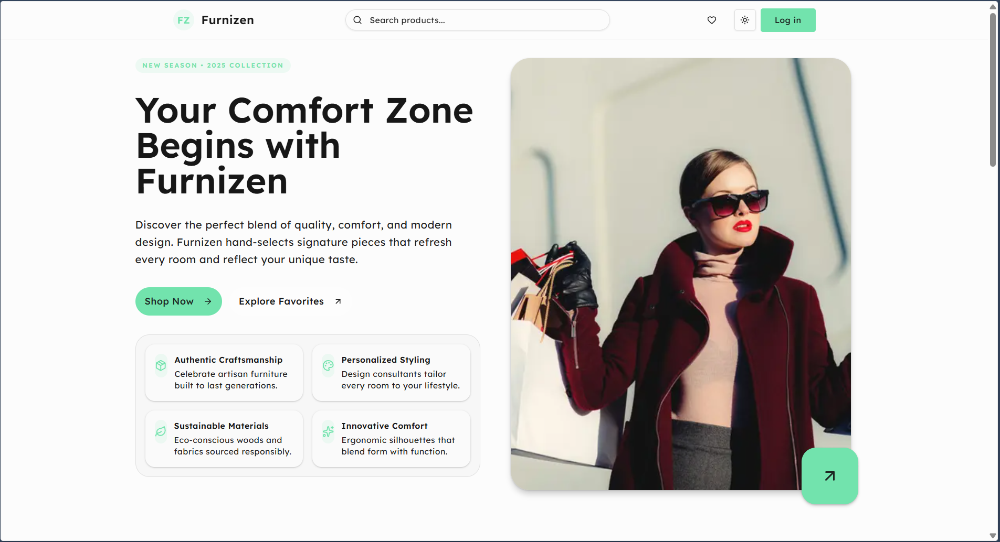
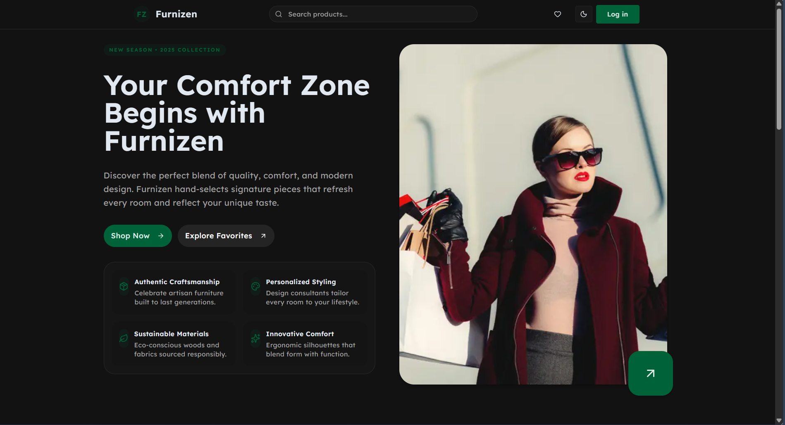
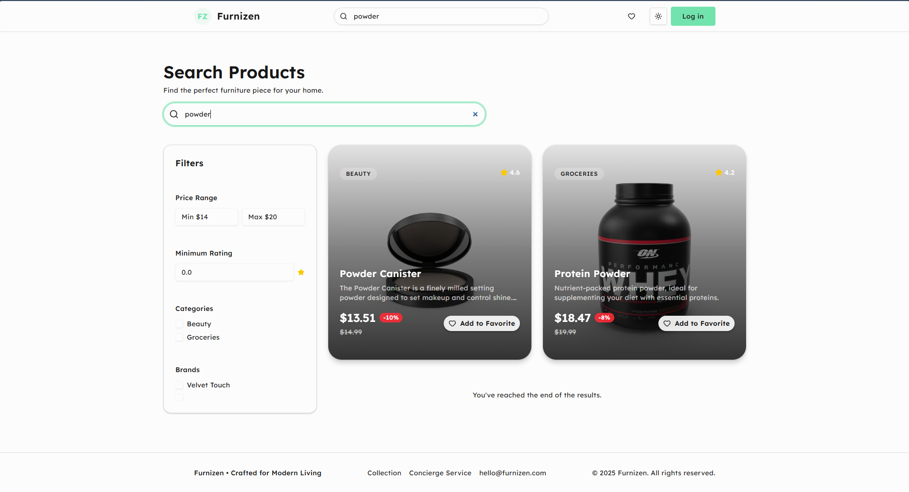
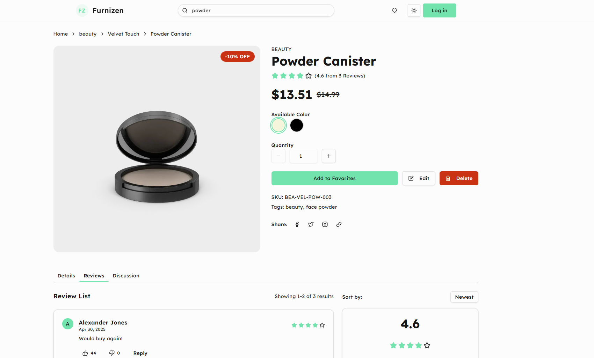
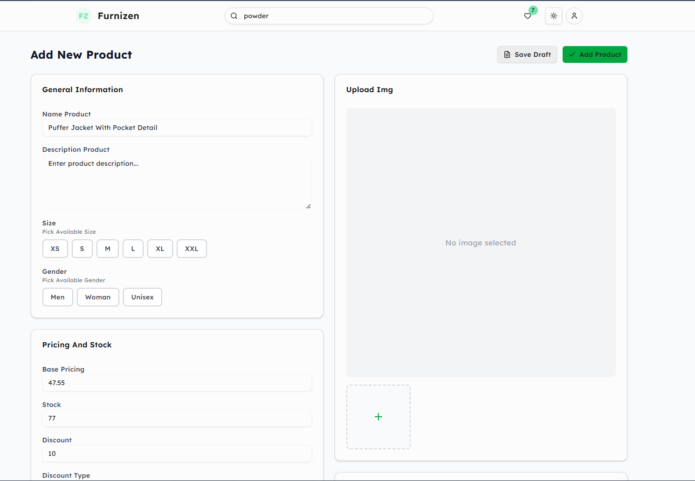
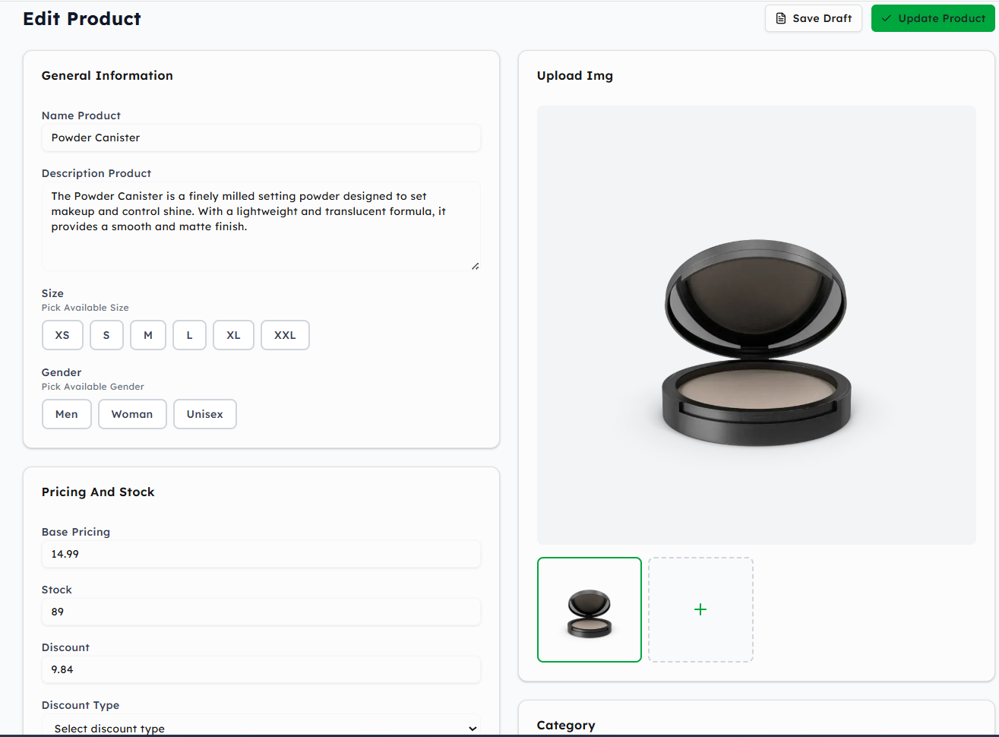
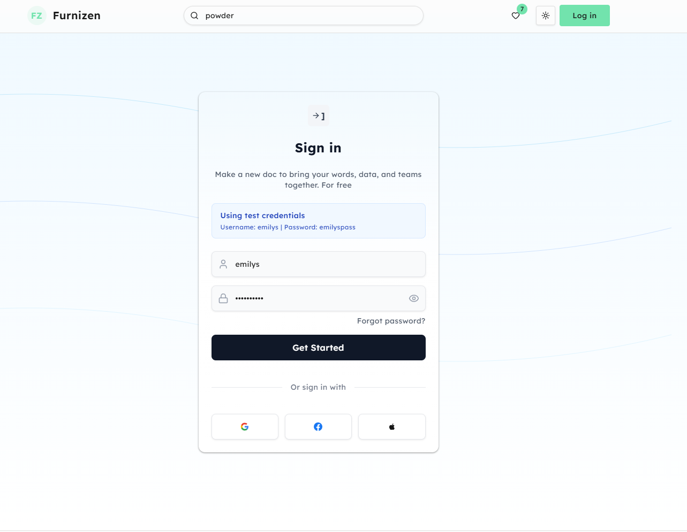

# Furnizen - Modern eCommerce Shop

A full-featured eCommerce application built with Next.js, TypeScript, and modern web technologies. This project demonstrates real-world frontend development skills including product management, search functionality, favorites system, and complete CRUD operations.

**Live Demo:** [https://test-project.yeab.works/](https://test-project.yeab.works/)



## 📋 Table of Contents

- [Features](#features)
- [Tech Stack](#tech-stack)
- [Screenshots](#screenshots)
- [Getting Started](#getting-started)
- [Project Structure](#project-structure)
- [API Integration](#api-integration)
- [Key Features Explained](#key-features-explained)
- [Deployment](#deployment)

## ✨ Features

### Core Features

1. **Product Listing Page** (`/`)

   - Fetch products from DummyJSON API
   - Display product cards with title, price, rating, category, and images
   - Infinite scroll pagination (loads 10 products at a time)
   - Add/Remove products from favorites
   - Responsive grid layout
   - Loading skeletons for better UX

2. **Product Details Page** (`/products/[id]`)

   - Detailed product information
   - Image gallery
   - Price, brand, stock, and rating display
   - Add to favorites functionality
   - Edit and delete product actions
   - Share functionality

3. **Favorites Page** (`/favorites`)

   - View all favorited products
   - Remove products from favorites
   - Persistent storage using localStorage
   - Empty state handling

4. **Create Product** (`/products/create`)

   - Form to add new products
   - Fields: title, description, price, stock, brand, category
   - Image URL input support
   - Form validation
   - Success/error toast notifications

5. **Edit Product** (`/products/[id]/edit`)

   - Pre-filled form with existing product data
   - Update product information
   - PATCH request to API
   - Form validation

6. **Delete Product**

   - Confirmation dialog before deletion
   - DELETE request to API
   - Toast notifications

7. **Search Functionality** (`/search`)

   - Search products by query
   - Real-time search results
   - Category filtering

8. **Authentication** (`/login`, `/signup`)
   - Mock authentication system
   - Login and signup pages
   - Token-based authentication

### Bonus Features

- ✅ **Toast Notifications** - Using Sonner for user feedback
- ✅ **Loading States** - Skeleton loaders and loading indicators
- ✅ **Error Handling** - Comprehensive error states and messages
- ✅ **Responsive Design** - Mobile-first approach with Tailwind CSS
- ✅ **Dark Mode Toggle** - Theme switching using Redux and next-themes
- ✅ **Mock Authentication** - Login/signup functionality
- ✅ **Modern UI** - Built with Shadcn UI components
- ✅ **Smooth Animations** - Framer Motion for enhanced UX

## 🛠 Tech Stack

### Framework & Language

- **Next.js 16** - React framework with App Router (`/src/app`)
- **TypeScript** - Type-safe development
- **React 19** - Latest React features and hooks

### Styling & UI

- **Tailwind CSS 4** - Utility-first CSS framework
- **Shadcn UI** - High-quality component library
- **Framer Motion** - Animation library
- **Lucide React** - Icon library

### State Management

- **Redux Toolkit** - Predictable state container
- **React Redux** - React bindings for Redux

### API & HTTP

- **Axios** - HTTP client for API requests
- **DummyJSON** - Mock API for products and authentication

### Additional Libraries

- **Sonner** - Toast notification system
- **next-themes** - Theme management
- **Recharts** - Chart library (for analytics)

## 📸 Screenshots

### Homepage - Hero Section



The homepage features a beautiful hero section with a call-to-action and modern design that adapts to light and dark themes.

### Product Listing



Browse products with infinite scroll pagination, search functionality, and category filters.

### Product Details



View detailed product information including images, specifications, ratings, and actions to edit or delete.

### Favorites Page


Manage your favorite products with a clean, organized interface.

### Create Product



Add new products with a comprehensive form including validation and image upload support.

### Edit Product



Update existing products with pre-filled forms and real-time validation.

### Login Page



Secure authentication interface with modern design.

## 🚀 Getting Started

### Prerequisites

- Node.js 18+ installed
- npm, yarn, pnpm, or bun package manager

### Installation

1. **Clone the repository**

   ```bash
   git clone https://github.com/itsyaba/ecommerce-test.git
   cd test-project
   ```

2. **Install dependencies**

   ```bash
   npm install
   # or
   yarn install
   # or
   pnpm install
   ```

3. **Set up environment variables**

   Create a `.env.local` file in the root directory:

   ```env
   NEXT_PUBLIC_API_URL=https://dummyjson.com
   NEXT_PUBLIC_SITE_URL=https://test-project.yeab.works
   ```

   > **Note:** `NEXT_PUBLIC_SITE_URL` is used for SEO metadata and Open Graph images. If not set, it defaults to `https://test-project.yeab.works`.

4. **Run the development server**

   ```bash
   npm run dev
   # or
   yarn dev
   # or
   pnpm dev
   ```

5. **Open your browser**

   Navigate to [http://localhost:3000](http://localhost:3000)

### Build for Production

```bash
npm run build
npm start
```

## 📁 Project Structure

```
test-project/
├── public/                 # Static assets and images
│   ├── hero-light.png
│   ├── hero-dark.png
│   ├── product-details.png
│   └── ...
├── src/
│   ├── app/               # Next.js App Router pages
│   │   ├── page.tsx       # Homepage
│   │   ├── layout.tsx     # Root layout
│   │   ├── providers.tsx  # Redux and theme providers
│   │   ├── favorites/     # Favorites page
│   │   ├── login/         # Login page
│   │   ├── signup/        # Signup page
│   │   ├── search/        # Search page
│   │   └── products/
│   │       ├── [id]/      # Product details
│   │       │   ├── page.tsx
│   │       │   └── edit/  # Edit product page
│   │       └── create/    # Create product page
│   ├── components/        # React components
│   │   ├── ui/           # Shadcn UI components
│   │   ├── navbar.tsx    # Navigation bar
│   │   ├── footer.tsx    # Footer component
│   │   ├── hero.tsx      # Hero section
│   │   ├── product-card.tsx
│   │   └── ...
│   ├── lib/              # Utilities and configurations
│   │   ├── api.ts        # API client and functions
│   │   ├── store.ts      # Redux store configuration
│   │   ├── utils.ts      # Utility functions
│   │   └── features/     # Redux slices
│   │       ├── favorites/
│   │       └── products/
│   └── hooks/            # Custom React hooks
│       ├── use-redux.ts
│       └── use-mobile.ts
├── package.json
├── tsconfig.json
├── next.config.ts
└── README.md
```

## 🔌 API Integration

### Base URL

```
https://dummyjson.com
```

### Endpoints Used

#### Products

- `GET /products` - Get all products (with pagination: `?limit=10&skip=0`)
- `GET /products/:id` - Get product by ID
- `GET /products/search?q={query}` - Search products
- `GET /products/categories` - Get all categories
- `GET /products/category/:category` - Get products by category
- `POST /products/add` - Create new product
- `PUT /products/:id` - Update product
- `DELETE /products/:id` - Delete product

#### Authentication

- `POST /auth/login` - User login
- `GET /auth/me` - Get current user (requires token)
- `POST /auth/refresh` - Refresh access token

### API Client

The API client is configured in `src/lib/api.ts` using Axios:

```typescript
import { api } from "@/lib/api";

// Fetch product
const product = await fetchProductById(1);

// Create product
const newProduct = await createProduct({
  title: "Product Name",
  price: 99.99,
  // ... other fields
});

// Update product
const updated = await updateProduct(1, { price: 89.99 });

// Delete product
await deleteProduct(1);
```

## 🎯 Key Features Explained

### Redux State Management

The application uses Redux Toolkit for state management with two main slices:

1. **Products Slice** (`src/lib/features/products/productsSlice.ts`)

   - Manages product list state
   - Handles pagination
   - Loading and error states

2. **Favorites Slice** (`src/lib/features/favorites/favoritesSlice.ts`)
   - Manages favorite products
   - Persists to localStorage
   - Toggle favorite functionality

### Infinite Scroll Pagination

Products are loaded in batches of 10 using the `skip` parameter:

- Initial load: `?limit=10&skip=0`
- Next batch: `?limit=10&skip=10`
- And so on...

The pagination is triggered on scroll using Intersection Observer API.

### Dark Mode

Dark mode is implemented using:

- `next-themes` for theme management
- Redux for theme state
- Tailwind CSS dark mode classes
- Persistent theme preference in localStorage

### Form Validation

All forms include:

- Required field validation
- Type checking (numbers, strings)
- Real-time error messages
- Success/error toast notifications

### Error Handling

Comprehensive error handling includes:

- API error catching
- User-friendly error messages
- Loading states
- Retry mechanisms
- Toast notifications for feedback

## 🔍 SEO Optimization

The application includes comprehensive SEO optimization:

### Meta Tags

- **Title**: Dynamic title with template support (`%s | Furnizen`)
- **Description**: Detailed, keyword-rich description
- **Keywords**: Relevant furniture and home decor keywords
- **Canonical URLs**: Prevents duplicate content issues

### Open Graph (Social Sharing)

- **og:title**: Optimized title for social media
- **og:description**: Engaging description for shares
- **og:image**: Uses `hero-light.png` as the preview image when sharing links
- **og:type**: Website type
- **og:url**: Canonical URL

### Twitter Cards

- **Card Type**: Large image card for better visibility
- **Title & Description**: Optimized for Twitter
- **Image**: Same hero image for consistency

### Search Engine Optimization

- **Robots**: Properly configured for search engine crawling
- **Google Bot**: Optimized settings for Google indexing
- **Structured Data**: Ready for schema markup addition

### Social Media Preview

When you share a link to Furnizen on social media platforms (Facebook, Twitter, LinkedIn, etc.), the `hero-light.png` image will automatically appear as the preview image, making your shares more engaging and professional.

## 🚢 Deployment

### Vercel (Recommended)

1. Push your code to GitHub
2. Import project in Vercel
3. Add environment variables:
   - `NEXT_PUBLIC_API_URL=https://dummyjson.com`
   - `NEXT_PUBLIC_SITE_URL=https://test-project.yeab.works` (or your production URL)
4. Deploy!

### Other Platforms

The application can be deployed to any platform that supports Next.js:

- Netlify
- AWS Amplify
- Railway
- DigitalOcean App Platform

## 📝 Scripts

```bash
# Development
npm run dev          # Start development server

# Production
npm run build        # Build for production
npm start           # Start production server

# Linting
npm run lint        # Run ESLint
```

## 🎨 Customization

### Theme Colors

Edit `src/app/globals.css` to customize the color scheme.

### API Configuration

Update `NEXT_PUBLIC_API_URL` in `.env.local` to use a different API endpoint.

### Components

All UI components are from Shadcn UI and can be customized in `src/components/ui/`.

## 📄 License

This project is open source and available under the MIT License.

## 🙏 Acknowledgments

- [DummyJSON](https://dummyjson.com/) for providing the mock API
- [Shadcn UI](https://ui.shadcn.com/) for the component library
- [Next.js](https://nextjs.org/) for the amazing framework
- [Vercel](https://vercel.com/) for hosting

---

**Built with ❤️ using Next.js, TypeScript, and modern web technologies**
